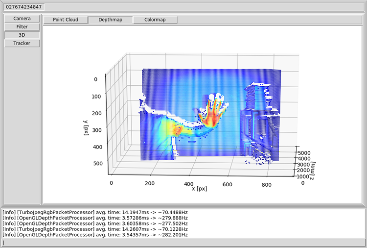

# Kinect2 along with OpenCV featuring Tk/Tcl in Action

This repository contains a Python application based on Tk/Tcl to show the interplay between OpenCV and the Kinect 2 (Xbox One) sensor in a comprehensive way. It has a minimalistic and kept simple UI with few widgets, and has been designed with extensibility in mind.



## Details

The UI of the application has several views, which are divided categorically:

* Camera: raw and altered images from RGB camera, IR and depth sensor
* Tracker: ROI and color trackers
* 3D: point clouds
* Depth: denoised depth maps
* IR: simple filters applied to IR images
* Features: various feature extractions
* BackSub: background substractions

## Usage

1. To start and stop streaming, click on the button labeled with the serial number of the Kinect2 device.
2. Use the mouse wheel to show and toggle grids on top of a view.
3. Double-clicking on (almost) any view or plot creates a timestamped image in `./capture`.
4. The ROI (an area to track) can be set with the right mouse button directly in the view that supports tracking.

## Requirements

The application works at least under GNU/Linux if the following requirements are met:

* Python 3.7.5, OpenCV 4.1.2, Tcl/Tk 8.6
* libfreenect2 0.2.0, pylibfreenect 0.1.3, libusb 1.0.23
* numpy 0.17.4, matplotlib 3.1.2, Pillow 6.1.2

## Troubleshooting

**LIBUSB_ERROR_ACCESS Access denied (insufficient permissions)**

You want to add rules to the userspace device files (udev) to permit access to the Kinect device via USB. Just add the following udev rules to any file in `/etc/udev/rules.d` and reboot:

```
SUBSYSTEM=="usb", ATTR{idVendor}=="045e", ATTR{idProduct}=="02c4", MODE="0666"
SUBSYSTEM=="usb", ATTR{idVendor}=="045e", ATTR{idProduct}=="02d8", MODE="0666"
SUBSYSTEM=="usb", ATTR{idVendor}=="045e", ATTR{idProduct}=="02d9", MODE="0666"
```

## Credits

- OpenKinect -- [Open source drivers for the Kinect for Windows v2 device (libfreenect2)](https://github.com/OpenKinect/libfreenect2)
- Ryuichi Yamamoto -- [A python interface for libfreenect2](https://github.com/r9y9/pylibfreenect2)
- Adrian Rosebrock -- [Ball Tracking with OpenCV](https://www.pyimagesearch.com/2015/09/14/ball-tracking-with-opencv/)
- Satya Mallick -- [Object Tracking using OpenCV](https://www.learnopencv.com/object-tracking-using-opencv-cpp-python/)